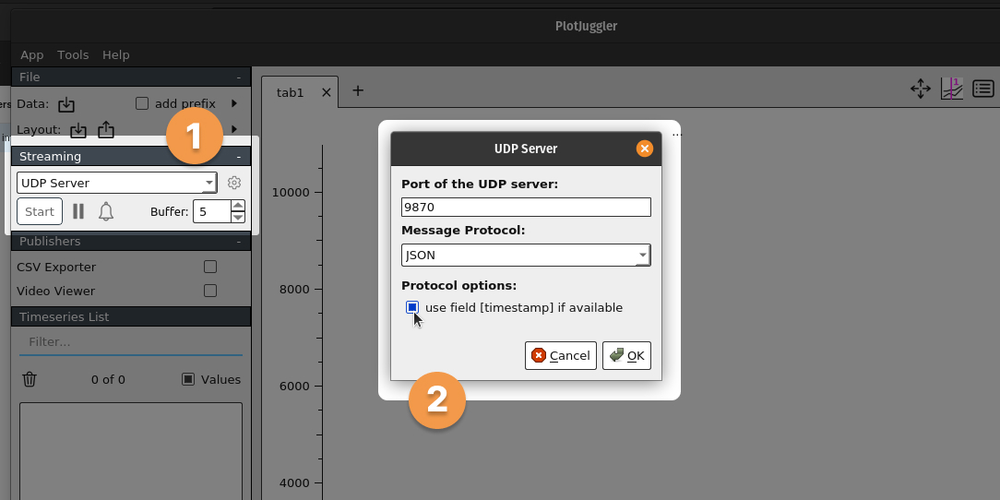

# PlotJuggler

## Description

This module allows for sending data from NUbots to [PlotJuggler](https://www.plotjuggler.io) for plotting in real time. It does this by listening for `DataPoint` messages (what we use for plotting in NUsight), transforming them to a suitable format and sending them to PlotJuggler via UDP.

## Usage

To plot data from a role you're working on using PlotJuggler, do the following.

1. [Download and install PlotJuggler](https://github.com/facontidavide/PlotJuggler#installation).
2. Launch PlotJuggler and start the UDP server.

   

   A. Under the **Streaming** section at the left of the PlotJuggler UI, select "UDP Server" and click "Start".

   B. In the window that pops up, enter a port, select "JSON" for **Message Protocol**, and check the box to use the timestamp field if available. Take note of the port and click "OK".

3. Add the `network::PlotJuggler` module to the role you're working on.
4. Update the `PlotJuggler.yaml` config file.

   - Set `forward_datapoints` to true to enable forwarding of data to PlotJuggler.
   - Under `udp_server`, set `ip_address` and `port` to the UDP server details from PlotJuggler. `ip_address` should be the address of the computer running PlotJuggler, or `127.0.0.1` if you're running PlotJuggler on the same computer as the role binary.

5. In your role, anywhere you want to plot data:

   - Include the `graph()` helper:

     ```cpp
     // In the includes section
     #include "utility/nusight/NUhelpers.hpp"

     // In the module namespace, to use `graph()` without specifying the namespace prefix every time
     using utility::nusight::graph;
     ```

   - Call `graph()` with the label and values you want to plot, and `emit()` the result:

     ```cpp
     // Plotting a single value
     emit(graph("Distance to ball", distance_to_ball));

     // 2-4 values will be labelled "x", "y", "z", "w" automatically
     emit(graph("Gyro", my_gyro_data.x(), my_gyro_data.y(), my_gyro_data.z()));

     // 5 or more values will be labelled "s0", "s1", "s2", ..., "s[n-1]" automatically
     emit(graph("My data", s0, s1, s2, s3, s4));
     ```

6. Build and run your role
7. Data should start appearing in the PlotJuggler sidebar when the role is running. To plot a data point, drag its label from the sidebar to the graph space at the right.

> **Note**
> If you're not seeing data in PlotJuggler, double check that the UDP server is running, `PlotJuggler.yaml` has the right configuration, and your role is sending data. You can also set the `send_debug_waves` config option to `true` to send sample data to PlotJuggler to test the connection.

## Consumes

- `message::eye::DataPoint` - listens for these from the rest of the codebase, transforming and forwarding them to PlotJuggler

## Emits

- `message::eye::DataPoint` - when debug waves are enabled for testing the connection to PlotJuggler
- JSON-formatted packets to PlotJuggler via UDP

## Dependencies

- JSON for modern C++ library
