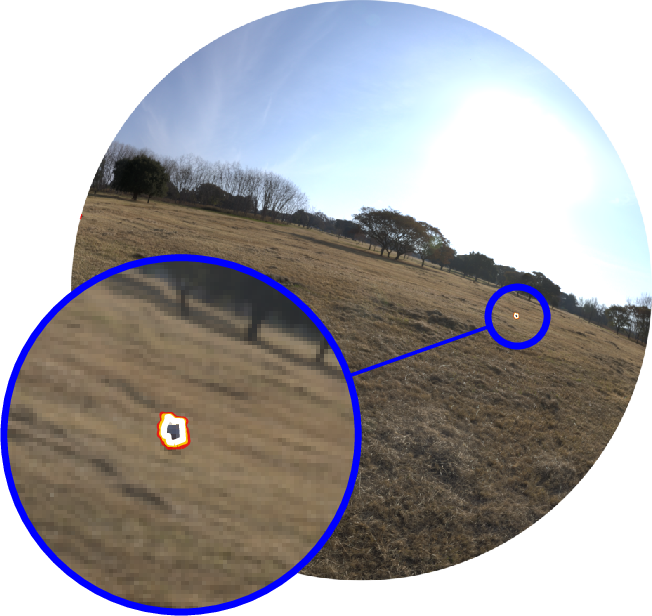
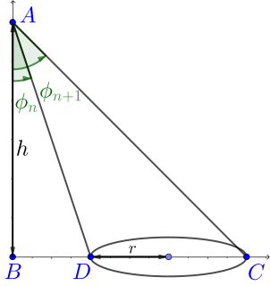
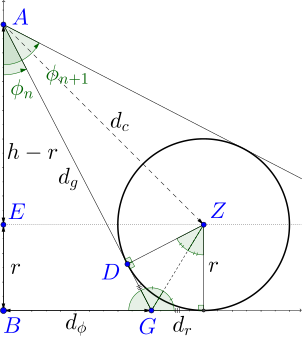
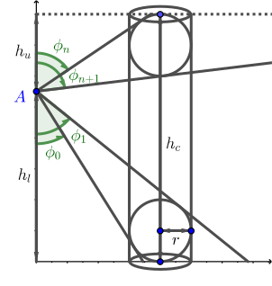
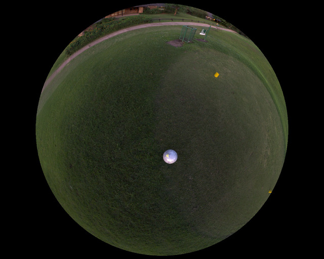
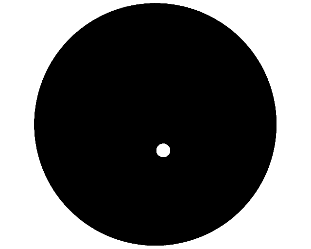

# Visual Mesh

[](https://gitter.im/Fastcode/VisualMesh?utm_source=badge&utm_medium=badge&utm_campaign=pr-badge&utm_content=badge)
If you have any questions or discussions while using the visual mesh, feel free to ask at gitter.

The Visual Mesh is an input transformation that uses knowledge a cameras orientation and position relative to an observation plane to greatly increase the performance and accuracy of a convolutional neural network.
It utilises the geometry of objects to create a mesh structure that ensures that a similar number of samples points are selected regardless of distance.
The result is that networks can be much smaller and simpler while still achieving high levels of accuracy.
Additionally it is very capable when it comes to detecting distant objects.
Normally distant objects become too small for a network to detect accurately, but as the visual mesh normalises its size detections are still accurate.



The geometry allows calculations of their visual size at varying distances
The code works by utilising geometry that calculates the values φ as inclination from below the camera and θ measured within the observation plane.
By chaining these together we eventually get a mesh


Implemented in this code is the geometry for 2D circles, and 3D spheres and cylinders.

  

The training implementation is written using TensorFlow using a custom TensorFlow op.
Once a network has been trained however, there exists custom OpenCL code that can execute the network much faster and with fewer requirements.

## Training

The training of the visual mesh using this implementation takes advantage of a tutor neural network to improve the training accuracy.
This tutor network weights the gradients by learning the error that occurs during the training.
Outlier sections are learned effectively.
For example, in the example training for detecting soccer balls, the field class contains many green points, and only a few points for field lines.
Without this tutor reweighting the network overtrains on grass and is unable to effectively interpret other objects that are not balls.

### Requirements

In order to execute the training for the Visual Mesh, several python libraries are required.

```
matplotlib
numpy
opencv-python
pyyaml
rdp
tensorflow
tqdm
```

Additionally [`cmake`](https://cmake.org/) and a C++ compiler that supports c++11 or later is required for building the c++ TensorFlow op.

In general this code is written to work with python3, however it should also work with python2 if needed.

### Building the TensorFlow op

In order to perform the training, the Visual Mesh TensorFlow op must be built.
To build the TensorFlow op

```sh
mkdir build
cd build
cmake ..
make
```

This should create the file `training/visualmesh_op.so` that contains the TensorFlow operation.

### Making a Dataset

This trainer consumes datasets in tfrecord format.
To create a tfrecord dataset, you can adapt the example code provided [here](./training/build_dataset.py).
This example code expects three folders containing an `image\d+.jpg`, `mask\d+.png` and `meta\d+.json`.
The meta files should look like

```json
{
  "height": 1.2,
  "lens": {
    "fov": 1.270637035369873,
    "focal_length": 868.04095212810634,
    "centre": [ 0.0, 0.0 ],
    "projection": "RECTILINEAR"
  },
  "rotation": [
    [ 0.1441880166530609, 0.937675416469574, 0.3161878287792206 ],
    [ -0.9609110951423645, 0.2089919149875641, -0.181583970785141 ],
    [ -0.23634754121303558, -0.27764594554901123, 0.9311565160751343 ]
  ]
}
```

The structure of the features in each example in the tfrecord file are
```python
{
  # The compressed bytes of the image in jpeg or png format
  "image": bytes,
  # The compressed mask image in png format
  "mask": bytes,
  # The projection of the lens EQUISOLID, EQUIDISTANT, RECTILINEAR
  "lens/projection": string,
  # The maximum field of view of the lens
  "lens/fov": float,
  # The focal length of the lens measured in pixels
  "lens/focal_length": float,
  # The offset from the centre of the lens to the centre of the image in pixels, the order is y, x to match tensorflow
  "lens/centre": float,
  # A 3x3 rotation matrix that stores the rotation from the observation plane to the camera
  # The cameras coordinate system is represented with x forward along the camera axis, y to the right, and z up
  "mesh/orientation": float[3][3],
  # The heigh of the camera above the observation plane
  "mesh/height": float,
}
```

#### Mask format

When training the Visual Mesh, the entire training image does not have to be segmented.
The mask images are encoded as png images where each unique colour represents a class.
The alpha channel of the stencil image can be used to intentionally leave areas unlabelled.
These regions will not be used when training.
This allows partial labelling to be done when it would be too difficult to label the whole image, or there is confusing data that should be excluded.

An example image and corresponding mask image is shown below.

 

### Configuration

When training, all options are provided in the form of a YAML configuration file.
An example of a yaml file with all the options documented can be found in the example file [11.yaml](./11.yaml)

### Executing training

To train a new network, create a yaml configuration file.
Then execute the following command

```sh
./mesh.py train [config.yaml] [output_dir]
```

The progress of the training can be monitored using tensorboard with the log dir looking at the output directory (or a parent of it).
If the output directory is not provided, it will default to `output`.


## Testing

Once you have a trained network, you can test it using the test command.

```sh
./mesh.py test [config.yaml] [output_dir]
```

This will output the average precision for each class, as well as the precision/recall curves and the final mean average precision (mAP).

## Using the VisualMesh

When using the Visual Mesh code in your own project, you do not need to include the TensorFlow library.
The C++ implementation of the visual mesh can be used by itself when loaded with a trained model.
These models are able to execute using a variety of engines to project and classify images.
This allows them to run faster and with less dependencies than the TensorFlow implementation would require.
Additionally it allows executing on devices that TensorFlow would not allow such as OpenCL devices.

Currently there are two engines that are supported when using the Visual Mesh.
The first of these is the CPU engine.
This is a basic engine that utilises normal c++ code to execute the Visual Mesh.
If you intend to use the CPU to execute the visual mesh and have OpenCL available, the OpenCL implementation on the CPU is faster than this one.

The second engine is an OpenCL based engine.
This engine utilises OpenCL and therefore can execute on a large variety of hardware and take advantage of multiprocessing.
The hardware it can execute on includes CPUs, Intel integrated GPUs and most NVIDIA or AMD GPUs.
One unfortunate omission to this is that the Jetson TX2 is unable to execute OpenCL code because NVIDIA are a bunch of evil people who hate things they don't control.

An example usage can be found in the example folder [here](./example/main.cpp).
Or alternatively this is the basic usage.
```cpp
#include "visualmesh.hpp"
#include "engine/opencl/opencl_engine.hpp"

int main() {
  // Paramters are radius, number of sample points, maximum distance to project
  visualmesh::geometry::Sphere<float> sphere(0.075, 5, 10);
  // Paramters are shape, minimum height to generate a LUT for
  // maximum height to generate a LUT for and the number of LUTs to generate
  visualmesh::VisualMesh<float, visualmesh::engine::opencl::Engine> mesh(sphere, 0.5, 1.5, 100);

  // When making a classifier make sure to keep a reference to the mesh that created it as it uses it internally
  // The mesh structure type can be found in src/mesh/network_structure.hpp
  auto classifier = mesh.make_classifier(structure);

  // Construct an image the lens and transformation matrix from camera to ground and get it's fourcc code
  void* image_data;
  uint32_t fourcc_code;
  visualmesh::mat4<float> Hoc; // A homogenous transformation matrix from the camera to the observation plane
  visualmesh::Lens<float> lens;

  visualmesh::ClassifiedMesh<float> classified = classifier(mesh.height(camera_height), image_data, fourcc_code, Hoc, lens);

  // The classified variable now contains a visual mesh that has been executed by the network.
}
```

## Contributing

Contributions to this project are welcome via pull request.
Style guides are enforced by clang-format for c++ and yapf for python.

If you would like to contribute to this project, an engine that executes using [Vulkan](https://www.khronos.org/vulkan/), [OpenGL](https://www.opengl.org/), or [CUDA](https://developer.nvidia.com/cuda-zone) would be appreciated.
Also if you use a different lens geometry or image format that is not supported, additions to the current code is welcome.

<!-- ## Citing

If you use the VisualMesh in your work, please cite it -->
